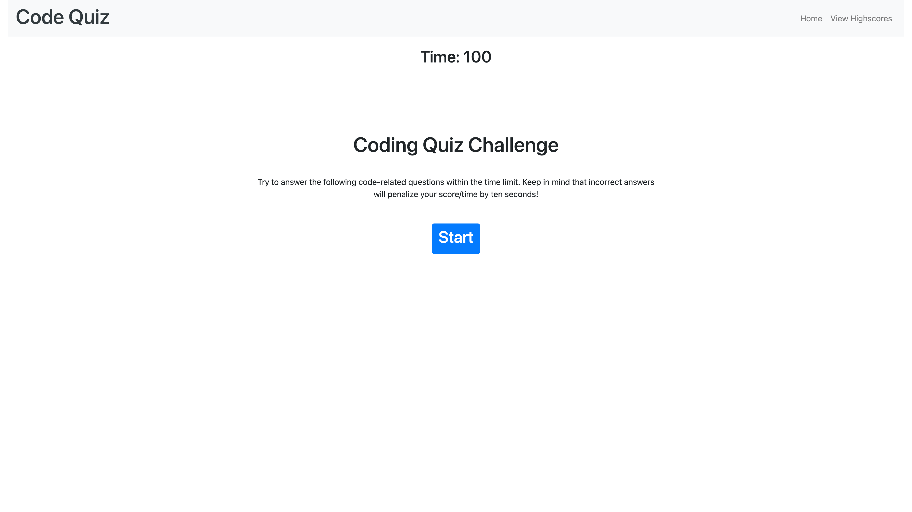
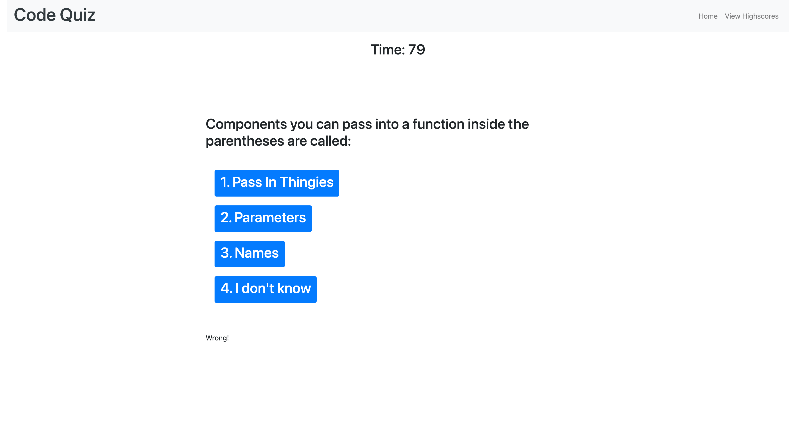
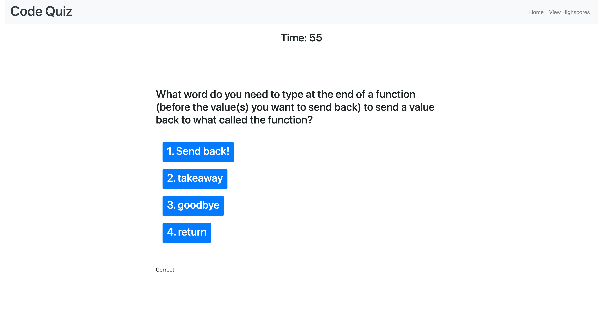
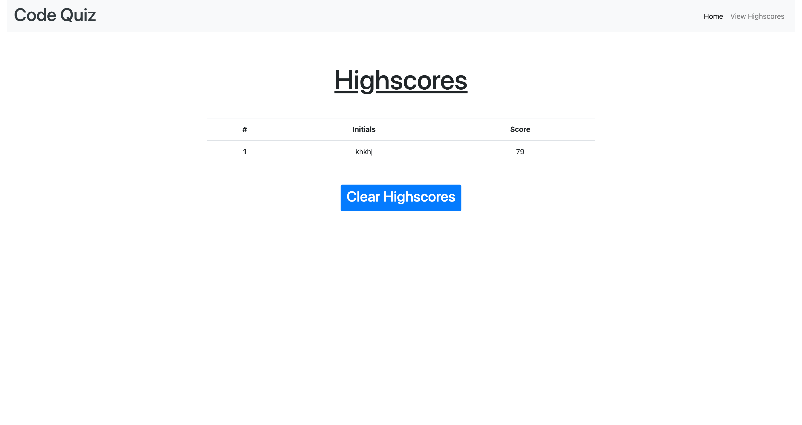
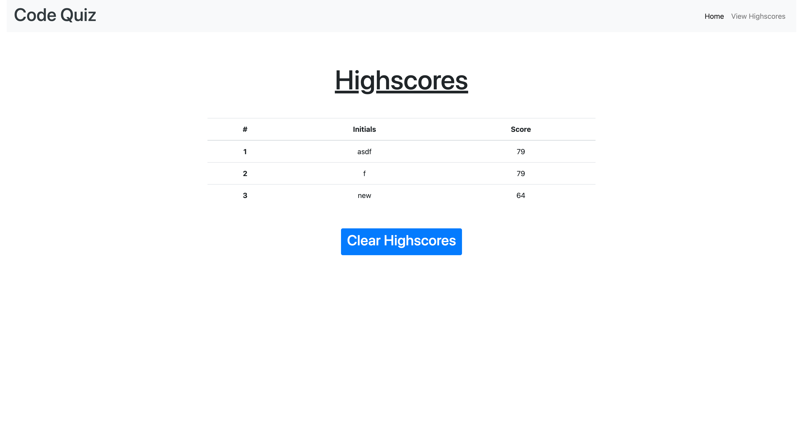
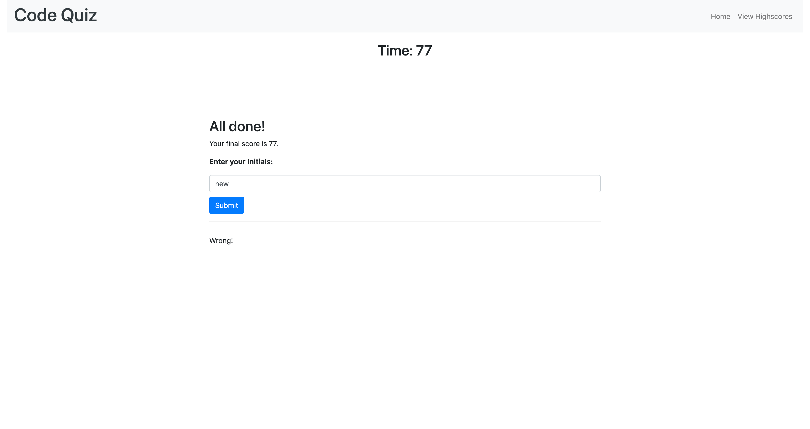

# Code-Quiz

View project here: https://koltondecker.github.io/Code-Quiz/

It's always important to know where you're at in your knowledge of javascript anywhere from being a beginner to a seasoned veteran of your programming craft. This website serves as a short code quiz to test your knowledge. A time will start upon clicking the start quiz button. 10 seconds is removed from the time if any wrong answers are chosen but no time is removed if the correct answer is chosen. After all questions are answered or the time runs out, the All Done page is displayed with your final score and an input box to submit your initials to the highscores page. These initials and the score will be pushed to local storage as an array of objects which can then be loaded to the page any time a user opens the highscores page as long as they haven't clicked the 'clear highscores' button which removes this array from local storage. 


## User Story

```
AS A coding boot camp student
I WANT to take a timed quiz on JavaScript fundamentals that stores high scores
SO THAT I can gauge my progress compared to my peers
```


## Acceptance Criteria

```
GIVEN I am taking a code quiz
WHEN I click the start button
- [x] THEN a timer starts and I am presented with a question
WHEN I answer a question
- [x] THEN I am presented with another question
WHEN I answer a question incorrectly
- [x] THEN time is subtracted from the clock
WHEN all questions are answered or the timer reaches 0
- [x] THEN the game is over
WHEN the game is over
- [x] THEN I can save my initials and score
```


## Mock-Up

Below are a few photos that show this project's functionality:










## Grading Requirements

This homework is graded based on the following criteria: 

### Technical Acceptance Criteria: 40%

- [x] * Satisfies all of the above acceptance criteria.

### Deployment: 32%

- [x] * Application deployed at live URL.

- [x] * Application loads with no errors.

- [x] * Application GitHub URL submitted.

- [x] * GitHub repository that contains application code.

### Application Quality: 15%

- [x] * Application user experience is intuitive and easy to navigate.

- [x] * Application user interface style is clean and polished.

- [x] * Application resembles the mock-up functionality provided in the homework instructions.

### Repository Quality: 13%

- [x] * Repository has a unique name.

- [x] * Repository follows best practices for file structure and naming conventions.

- [x] * Repository follows best practices for class/id naming conventions, indentation, quality comments, etc.

- [x] * Repository contains multiple descriptive commit messages.

- [x] * Repository contains quality README file with description, screenshot, and link to deployed application.


## Review

You are required to submit BOTH of the following for review:

- [x] * The URL of the functional, deployed application.

- [x] * The URL of the GitHub repository. Give the repository a unique name and include a README describing the project.